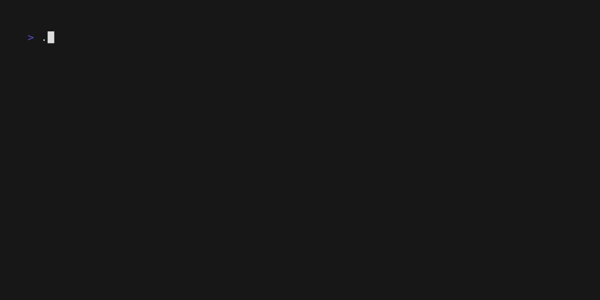
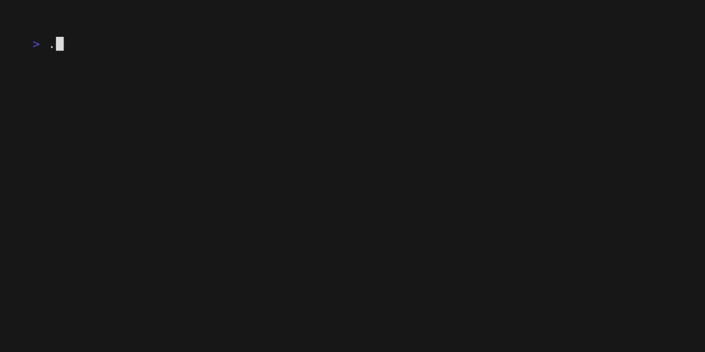

<h1 align="center">Welcome to docwiz 👋</h1>
<center>

[](https://www.gnu.org/software/bash/) [](https://golang.org/)

</center>

---

<center>

<!-- statistics -->

</center>

> DocWiz is a versatile command-line tool that helps generate various types of project documentation like README, LICENSE, ROADMAP, CONTRIBUTORS, and more. It leverages templates and user inputs to create customized and professional documentation files.

## 📦 Install
<!-- description -->

## 🚀 Usage
> [!NOTE]
> The details are viewed using `docwiz -h`

### readme
Automatic scanning technology stack generation (✨RECOMMEND)


Based on TUI to generate


### changelog
```cmd
docwiz changelog
```

### contributor
```cmd
docwiz contributors
```

### gitignore


### license


### commit


### copyright


### roadmap
```cmd
docwiz roadmap
```

## 🤝 Contributing

Contributions, issues and feature requests are welcome.<br />
Feel free to check [issues page](https://github.com/Ansurfen/docwiz/issues) if you want to contribute.<br />
[Check the contributing guide](./CONTRIBUTING.md).<br />

## 📝 License

This software is licensed under the MIT license, see [LICENSE](./LICENSE) for more information.

---

_This README was generated with ❤️ by [docwiz](https://github.com/ansurfen/docwiz)_