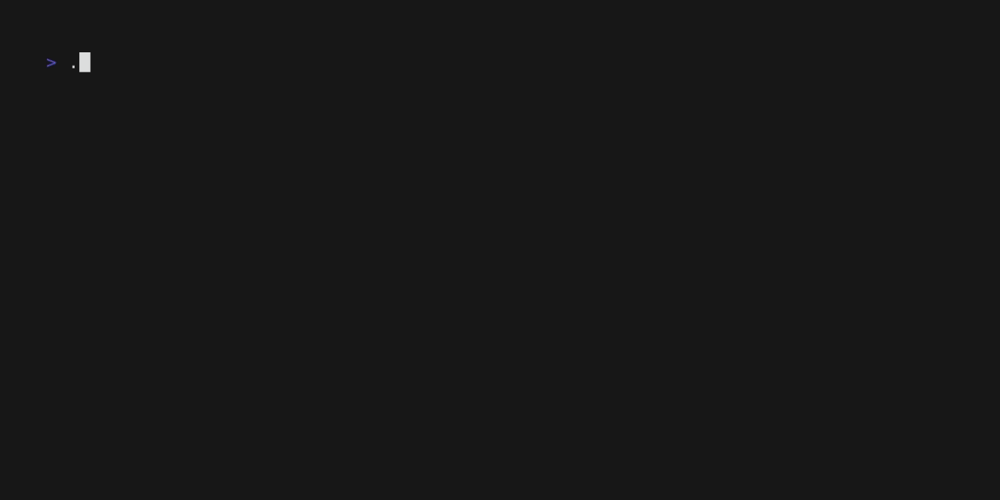
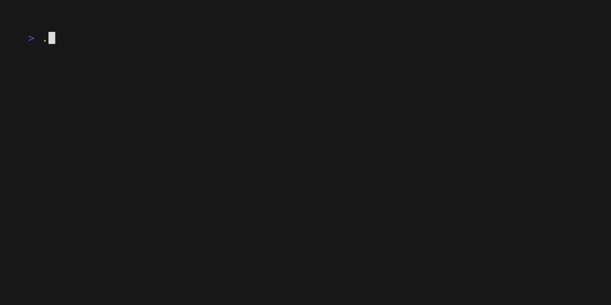

<h1 align="center">Welcome to docwiz 👋</h1>
<center>

[](https://www.gnu.org/software/bash/) [](https://golang.org/) [](https://learn.microsoft.com/en-us/powershell/)

</center>

---

<center>

<!-- statistics -->

</center>

[English](../../README.md) | 简体中文

> DocWiz 是一个多功能的命令行工具，可帮助生成各种类型的项目文档，如 README、LICENSE、ROADMAP、CONTRIBUTORS 等。它利用模板和用户输入来创建自定义和专业的文档文件。

## 📦 安装

### 自己构建
```bash
git clone git@github.com:Ansurfen/docwiz.git
cd ./docwiz

# windows
./build.ps1

# linux, darwin
./build.sh
```

### 直接下载
你能够在[这里](https://github.com/Ansurfen/docwiz/releases)下载到二进制版本。

## 🚀 使用
> [!NOTE]
> The details are viewed using `docwiz -h`

### readme
自动扫描生成技术栈 (✨推荐)


基于TUI创建


### changelog
```cmd
docwiz changelog
```

### contributor
```cmd
docwiz contributors
```

### gitignore


### license


### commit


### copyright


### roadmap
```cmd
docwiz roadmap
```

## 🤝 Contributing

Contributions, issues and feature requests are welcome.<br />
Feel free to check [issues page](https://github.com/Ansurfen/docwiz/issues) if you want to contribute.<br />
[Check the contributing guide](./CONTRIBUTING.md).<br />

## 📝 License

This software is licensed under the MIT license, see [LICENSE](./LICENSE) for more information.

---

_This Markdown was generated with ❤️ by [docwiz](https://github.com/ansurfen/docwiz)_